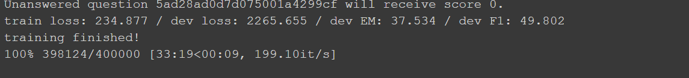

# QANet-question-answering-system

Question Answering system powered by AI using deep learning model called **QANet**.
QANet model is transformer version of using **BIDAF** (**BID**irectional **A**ttention **F**low) method. 
As the name suggests, BIDAF models mainly constructed to use the attention flow from both Context to question and from question to context.
In the conventional question answering system only question to context attention flow was used.
This baseline BIDAF method was initially suggested only for the RNN (LSTM) network, But in order capitalize the computing and parallel processing powers of the transformer , the same method was later extended to transformers.
Many QANet models were leading the score board for the SQuAD dataset in Stanford official website, until the advent of BERT model, which basically overtook all other models.

# Pre-requistics

 Python- 3.7
 Torch - 1.4.0 and above
 numpy -1.16.4 and above
 Torchtext - 0.5.0

# Files

Dataset used here is the squad 2.0 dataset and the same can be downloaded from the below link.
https://rajpurkar.github.io/SQuAD-explorer/

**data.py** - Contains the code to pre-process the squad 2.0 dataset and also to split them in batches using torch text module.

**ema.py** - Contains the code to implement Exponential Moving Average optimization process, 
which helps the model to normalize the updation of the weights to avoid peak up and to have smooth gradient descent curve.

**Embedding.py** - Contains the code to formulate word embeddings and character embedding for both context and question.

**Encoder.py** - Contains the code for the Encoder block in the QANet.

**evaluate.py** - Calculates the F1 and EM (Exact Match) for the predicted results.

**main.py** - Contains the main code where the arguments are set and its the executable file which will run the training and also test the model.

**model.py** - Contains the code of the model combining all other components in the QANet.

**predict.py** - Contains the code to demonstrate the model with any context and questions.

**utils.py** - Contains the code of the helper functions and sub components required for the model.

# Downloads and Setup

Once you clone this repo, run the main.py file to train the model and test the test-dataset available in the SQuAD 2.0.
You can also upload this in the Google drive or in kaggle and run the same in GPU.

**Note:-** Proper paths needs to be mentioned in the main.py and data.py files where ever applicable.

# Evalution metric

**F1 and EM scores** were used as the evalution metric to measure the quality of the model.
Below is the F1 and EM score of this model.

It is still an average F1 and EM score compared to the baseline paper. But the baseline QANet paper requires word embedding dimension value upto 300
and 7 stacked up encoder in the model encoder whereas i used only 100 dimensions as embedding dimension and 4 stacked up encoder in the model encoder.
and maximum context length was kept to 150 to speed up the training process.

# Demo

Please find the below gif file which shows Demo results of sample context and questions.

# References

I basically wrote the code for the model framework part from scratch, But took of the some supplementary/helper functions from these GITHUB links.
* [BiDAF LSTM model](https://github.com/galsang/BiDAF-pytorch)
* [Transformer](https://github.com/SamLynnEvans/Transformer)
